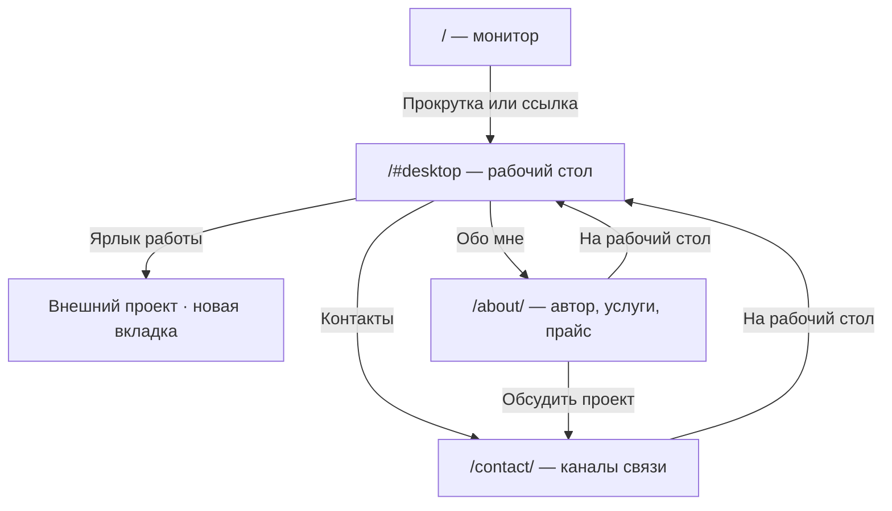

# Сценарий экранов

Статус: композиционный план для реализации, не готовые скриншоты. Режим основного опыта по Impeccable — Experience; при чтении «Обо мне» выразительность не должна затруднять поиск услуг и цены.

## Direction contract

THESIS: qwave — личный компьютер как портфолио. Сначала физический монитор, затем собственный рабочий стол; работы исследуются через ярлыки.

OWN-WORLD: чёрные поверхности, белые пиксельные иконки, оригинальная символьная графика, крупный Golos Text и служебный IBM Plex Mono. Прямые углы и инверсия выделения.

STORY: посетитель узнаёт имя, открывает рабочий стол, выбирает работу или читает об авторе. Реальные ссылки добавляются отдельно от оболочки; отсутствующие материалы явно обозначены.

FIRST VIEWPORT: короткая шапка, очень крупное qwave слева, тёмный монитор справа и в центре нижней части кадра. Короткое приглашение и светлая кнопка входа слева внизу. Предметная сцена занимает большую часть экрана. Signature interaction — управляемый прокруткой пролёт камеры внутрь монитора: сцена удерживается в окне, экран становится полноэкранным интерактивным ASCII-столом. Вход по кнопке пропускает пролёт.

FORM: реализация принятого пользователем дизайн-кода напрямую в коде. Выбор мира закреплён референсами пользователя и подтверждён перед реализацией; предыдущий seed 723bdc08 не заменяет эту визуальную привязку. Композиционные картинки не создаются повторно.

FINISH: unreviewed and undocumented is unfinished; this build ends with the finish review, the verdict, DESIGN.md, and every shipping raster carrying its provenance

## Первый кадр → рабочий стол

Посетитель видит монитор в ракурсе 3/4. Сцена занимает основную часть кадра, имя и вход остаются настоящим HTML. Монитор ориентировочно занимает 55–70% ширины desktop; на mobile камера приближается к фронтальному ракурсу, сохраняя узнаваемый корпус.

```text
┌──────────────────────────────────────────────────────────────┐
│ [Имя / бренд]              Рабочий стол   Обо мне   Контакты  │
│                                                              │
│                ┌─────────────────────────┐                   │
│                │  превью ASCII-стола      │                   │
│                │  [файл]  [автор]         │                   │
│                │      собственная        │                   │
│                │      графика            │                   │
│                └────────────┬────────────┘                   │
│                       ──────┴──────                          │
│ [Имя / специализация]            Открыть рабочий стол ↗       │
│                         ↓ Прокрутите вниз                     │
└──────────────────────────────────────────────────────────────┘
                     естественная прокрутка
┌──────────────────────────────────────────────────────────────┐
│ [Имя / бренд]                                  Рабочий стол  │
│                                                              │
│ [иконка]  [иконка]                                           │
│ Проект 1↗ Проект 2↗             ASCII-композиция              │
│                                                              │
│ [иконка]  [иконка]             свободное поле вокруг           │
│ Проект 3↗ Обо мне             активных элементов              │
│                                                              │
│ [иконка]                                                     │
│ Контакты                                                     │
│──────────────────────────────────────────────────────────────│
│ Рабочий стол        Обо мне        Контакты         Начало ↑  │
└──────────────────────────────────────────────────────────────┘
```

«Проект 1–3» здесь обозначают позиции, а не выдуманное наполнение. Иконки можно переставить внутри сетки после получения количества и длины названий. Фон занимает преимущественно центр и правую часть; под ярлыками он затихает до почти чёрного. На малой высоте страница прокручивается, элементы не обрезаются.

## Обо мне и примерный прайс

```text
┌──────────────────────────────────────────────────────────────┐
│ / Обо мне                              ← На рабочий стол     │
│                                                              │
│ Крупный заголовок                                             │
│ об авторе                                                    │
│                                                              │
│ [01] Кто я                                                   │
│ Короткий текст                  [портрет / графика]           │
│ о специализации                 [только свой ассет]           │
│                                                              │
│                                 [02] Как работаю             │
│ [03] Услуга                     Краткое описание подхода     │
│ Состав и результат                                           │
│ От [согласованная сумма]                                      │
│                                 [04] Услуга                  │
│                                 Состав и результат           │
│                                 От [согласованная сумма]      │
│                                                              │
│ Стоимость зависит от задачи.          Обсудить проект ↗       │
│ ← На рабочий стол                                            │
└──────────────────────────────────────────────────────────────┘
```

Смысловой порядок: автор → подход → услуги/прайс → контакт. Смещение создаётся интервалами, а не случайным позиционированием. Если портрета нет, не добавлять стоковое лицо: увеличить типографический блок или использовать собственную абстрактную графику. Не оставлять незаполненный прямоугольник на опубликованной странице.

## Контакты

Та же строка раздела и возврат. Один крупный заголовок «Обсудим проект», ниже предоставленные каналы связи в виде крупных текстовых строк. Небольшая ASCII-композиция сбоку допускается, если ссылки остаются главным действием. Статус занятости и время ответа публикуются только по данным автора.

## Mobile

Первый кадр: имя, читаемая композиция монитора, ссылка на рабочий стол. Рабочий стол: 2–3 колонки ярлыков, подписи под иконками, графика менее плотная. Внутренние разделы: одна колонка, последовательность содержания сохранена, прайс не требует горизонтального скролла. Возврат всегда доступен без обязательного браузерного жеста «назад».

## Переходы



Прямой вход разрешён в любой внутренний маршрут. Вход с рабочего стола сохраняет ярлык-источник; возврат восстанавливает фокус. При прямом открытии раздела, когда источника нет, ссылка возврата фокусирует заголовок рабочего стола. Внешний проект не заменяет SPA в текущей вкладке.

## Что проверить на прототипе

- При первом взгляде понятны монитор и вход, а после прокрутки — ярлыки работ.
- Тёмный корпус различим, маленькие подписи не теряются в ASCII-фоне.
- За один клик можно открыть работу; за один клик из раздела вернуться к ярлыкам.
- Длинное имя, длинное название проекта, одна работа и шесть работ не ломают сетку.
- На 360px, при увеличенном тексте и reduced-motion все действия доступны.
- Прямые URL, reload и история работают; невидимый canvas не ловит клики.

Открытые материалы: имя, специализация, собственная графика/портрет, реальные ссылки работ, состав услуг, цены и контакты. Открытая визуальная проверка: окончательная гарнитура и кадрирование на реальном макете.
